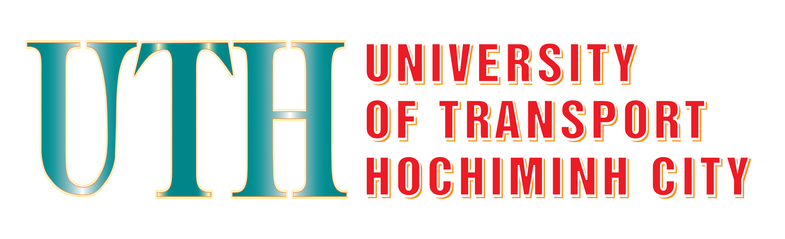

# [Trường Đại học Giao thông vận tải TP.HCM - UTH](https://ut.edu.vn/)

- Tài liệu học tập các môn của ngành Công nghệ thông tin, chuyên ngành Công nghệ thông tin (Khóa 22) *(Đang update...)*
- :no_entry: ***Bộ tài liệu chỉ mang tính chất tham khảo, nghiên cứu thêm và không được dùng thay thế cho các bài nộp cho môn học*** :no_entry:
- :no_entry: ***Không phụ thuộc vào bộ tài liệu này để tránh chủ quan trong việc học, vì bài giảng & tài liệu của Thầy/Cô trên lớp là tốt nhất & đáng tin cậy nhất*** :no_entry:
- :no_entry: ***Vui lòng không sử dụng bộ tài liệu này cho các mục đích ngoài việc học, nghiên cứu*** :no_entry:
- Tác giả chỉ mong muốn tổng hợp các tài nguyên, kiến thức cần thiết cho các môn học tại Trường, giúp các bạn Sinh viên tìm kiếm nhanh chóng & học tập hiệu quả hơn, **không nhằm mục đích sao chép, trích dẫn.... để kinh doanh hay lấy làm bản quyền riêng.**
***
:triangular_flag_on_post:**Một số nội dung có thể chưa cập nhật/đầy đủ do tính chất thay đổi liên tục của ngành Công nghệ thông tin & chủ trương của Trường, hoặc do chủ bộ tài liệu đang tham gia học tập bộ môn đó**:triangular_flag_on_post:
***
**Lưu ý:** Nếu bạn muốn sử dụng các tài liệu trong bộ này, khuyến khích bạn ```git clone``` repository này về, mỗi lần tác giả cập nhật, bạn chỉ cần dùng các lệnh cập nhật local của bạn.
***
:star:**Cảm ơn bạn đã ghé thăm. Chúc các bạn sử dụng hiệu quả bộ tài liệu, học tập tốt và đạt được nguyện vọng của bản thân**:star:

***
## 1. Các môn về Công nghệ thông tin.
- An toàn thông tin  
- Cấu trúc dữ liệu và giải thuật
- Cấu trúc rời rạc  
- Chuyên đề hệ thống giao thông thông minh  
- Chuyên đề thực tế 1
- Cơ sở dữ liệu  
- Công nghệ phần mềm  
- Hệ điều hành - OS  
- Hệ quản trị cơ sở dữ liệu  
- Kiểm chứng phần mềm  
- Kiến trúc máy tính  
- Kỹ thuật lập trình C++  
- Lập trình hướng đối tượng - OOP  
- Lập trình Java core  
- Lập trình mạng
- Lập trình ứng dụng di động 
- Lập trình web  
- Mạng máy tính cơ bản  
- Mạng máy tính nâng cao  
- Nhập môn CNTT - Python  
- Phân tích thiết kế giải thuật
- Phân tích thiết kế hệ thống  
- Thiết kế cơ sở dữ liệu  
- Thiết kế mạng
- Xử lý ảnh & thị giác máy tính 
- *(Còn nữa...)*

## 2. Các môn về chính trị, pháp luật.
- Pháp luật đại cương  
- Triết học Mác – Lênin  
- Kinh tế chính trị Mác – Lênin  
- Chủ nghĩa xã hội khoa học  
- Tư tưởng Hồ Chí Minh  
- Lịch sử Đảng Cộng sản Việt Nam

## 3. Các môn toán cơ bản
- Giải tích 1
- Toán chuyên đề 1 (Xác suất và thống kê)
- Đại số tuyến tính
- Tối ưu hóa

## 4. Các môn về quản trị, kỹ năng mềm, quân sự.
- Kỹ thuật viết và trình bày (Kỹ năng mềm 3)  
- Quân sự  
- Quản trị doanh nghiệp CNTT  
- Quản trị dự án CNTT
- Quản trị dự án phần mềm 
- Tin học cơ bản
- *(Còn nữa...)*

## Ngoài ra còn có các file như sau:
- Hướng dẫn trình bày bài tập lớn (gồm cách trình bày file báo cáo, căn chỉnh văn bản...).
- Theme Powerpoint UTH.
- Hướng dẫn chi tiết trình bày luận văn...
***
## Các trang web học tập cần sử dụng của Trường:
- [https://daotao.ut.edu.vn/](https://daotao.ut.edu.vn/) - Xem thông báo của Phòng Đào tạo (Đăng ký học phần, tạm hoãn nghĩa vụ...).
- [https://portal.ut.edu.vn/](https://portal.ut.edu.vn/) - Xem thời khóa biểu, thông tin cá nhân (bao gồm điểm số), đăng ký học phần, công nợ học phí, chương trình khung...
- [https://courses.ut.edu.vn/](https://courses.ut.edu.vn/) - Nơi các Thầy/Cô upload tài liệu học tập cho từng môn, bài tập, nộp bài tập, thi giữa kỳ, cuối kỳ, quét trùng lặp...
- [https://it3e.ut.edu.vn/](https://it3e.ut.edu.vn/) - Trang của Viện Công nghệ thông tin, Điện và Điện tử (trước kia là Khoa Công nghệ thông tin), thông tin về khoa, học kỳ doanh nghiệp, thông báo thực tập của các công ty...)
- ***Và nhiều trang web, hội nhóm khác***
